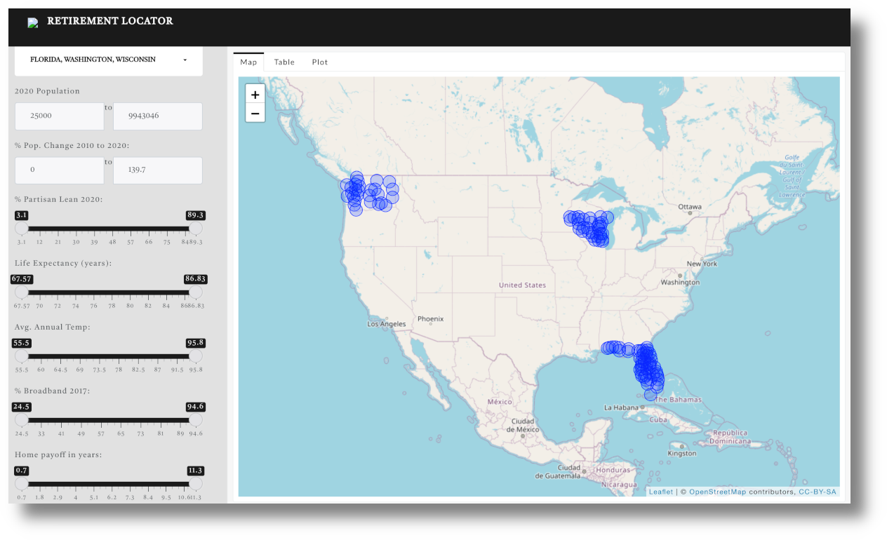

<!-- README.md is generated from README.Rmd. Please edit that file -->

```{r, include = FALSE}
knitr::opts_chunk$set(
  collapse = TRUE,
  comment = "#>",
  fig.path = "man/figures/README-",
  out.width = "100%"
)
```

# retirement

<!-- badges: start -->
[](https://lifecycle.r-lib.org/articles/stages.html#experimental)
[](https://github.com/RobWiederstein/retirement/actions)
[](https://travis-ci.com/RobWiederstein/retirement)
[](https://codecov.io/gh/RobWiederstein/retirement?branch=main)
<!-- badges: end -->




# Introduction

The goal of the 'retirementLoc' package was to consolidate some diverse and, for some, pertinent factors on where to locate in retirement.  The data is located in the `retirementLoc` package but displayed on a separate dashboard.  Criteria were included in the following order:

- the state name;
- the county name;
- population (estimate) in 2020;
- percent change of population since 2010;
- partisan lean or percent of population voting Democrat in the 2020 presidential race;
- life expectancy;
- average annual temperature;
- broadband penetration as of 2017;
- median value of owner occupied housing from 2009 adjusted for inflation and divided by average annual household income.


## Installation

You can install the released version of retirement from [CRAN](https://CRAN.R-project.org) with:

``` r
install.packages("retirementLoc")
```

## Load Data

This is a basic example which shows you how to solve a common problem:

```{r load-data}
library(retirementLoc)
```

## Common Questions

The data can provide some general guidance as to what parts of the county have reasonable housing prices relative to wages.  For example, the code below might be used to answer that question.

```{r example}
retirementLoc |>
        dplyr::arrange(years_to_payoff) |>
        dplyr::select(stname, ctyname, pop_2020, years_to_payoff) |>
        dplyr::slice(1:5)
```

You'll still need to render `README.Rmd` regularly, to keep `README.md` up-to-date. `devtools::build_readme()` is handy for this. You could also use GitHub Actions to re-render `README.Rmd` every time you push. An example workflow can be found here: <https://github.com/r-lib/actions/tree/master/examples>.


# Displaying Code Blocks

In that case, don't forget to commit and push the resulting figure files, so they display on GitHub and CRAN.
