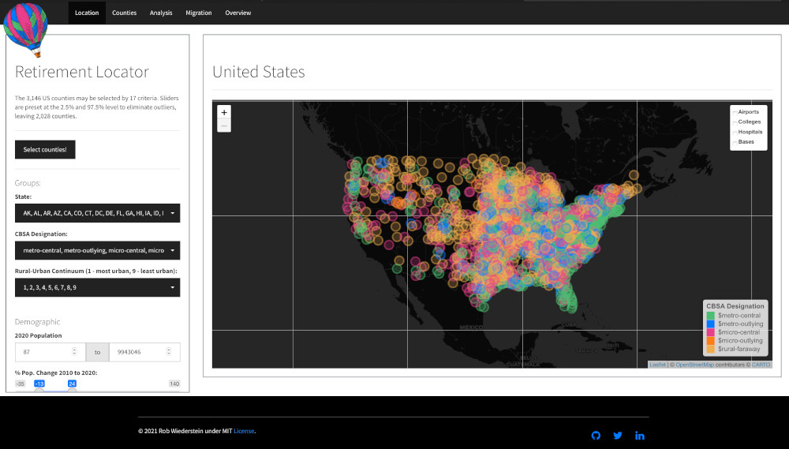

<!-- README.md is generated from README.Rmd. Please edit that file -->

```{r options, include = FALSE}
knitr::opts_chunk$set(
  collapse = TRUE,
  comment = "#>",
  fig.path = "man/figures/",
  out.width = "100%"
)
```

```{r load-data, include = F}
library(retirementData)
library(kableExtra)
```


<!-- badges: start -->
[](https://lifecycle.r-lib.org/articles/stages.html#experimental)
[](https://github.com/RobWiederstein/retirement/actions)
[](https://img.shields.io/badge/license-MIT-bright%20green)
[](https://codecov.io/gh/RobWiederstein/retirement?branch=main)
[](https://img.shields.io/github/last-commit/RobWiederstein/retirementData)
<!-- badges: end -->

<h4 align= "center">
<a href='https://rob-wiederstein.shinyapps.io/retirementdash/'><br/></a>
<a href='https://rob-wiederstein.shinyapps.io/retirementdash/'>Retirement Locator</a>
</h4>

# Introduction

The goal of the `retirementData` package was to consolidate some diverse and relevant factors on where to locate for retirement.  The data is located in the `retirementData` package but displayed on a separate dashboard [here](https://rob-wiederstein.shinyapps.io/retirementdash/?_ga=2.99037854.1258475930.1633524763-1285109657.1633184174).  Within the package, the main dataset is `retirementLoc`. Its variables are:

```{r list-variables, echo=F, fig.align='center'}
library(retirementData)
names(retirementLoc) |> 
  matrix(ncol = 3, byrow = T) |>
  kableExtra::kbl() |>
  kable_styling(bootstrap_options = "striped", full_width = T, position = 'center')
```


## Installation

You can install the development and experimental version of `retirementData` from its [repository](https://github.com/RobWiederstein/retirementData) with:

``` r
# Or the development version from GitHub:
# install.packages("devtools")
install_github("RobWiederstein/retirementData")
```

## Load Data

Once the development package is installed, it can be loaded via:

```{r}
data("retirementData")
```


## Common Questions

The data can provide some practical guidance as to candidate locations by identifying high growth counties, reasonable housing costs, air quality and life expectancy. For example, the code below might be used to answer where housing costs are reasonable:

```{r example}
library(retirementData)
retirementLoc |>
        dplyr::arrange(years_to_payoff) |>
        dplyr::select(state, county, pop_2020, years_to_payoff) |>
        dplyr::slice(1:5)
```

<!--You'll still need to render `README.Rmd` regularly, to keep `README.md` up-to-date. `devtools::build_readme()` is handy for this. You could also use GitHub Actions to re-render `README.Rmd` every time you push. An example workflow can be found here: <https://github.com/r-lib/actions/tree/master/examples>.


# Displaying Code Blocks

In that case, don't forget to commit and push the resulting figure files, so they display on GitHub and CRAN.
-->

## Code of Conduct

Please note that the retirementData project is released with a [Contributor Code of Conduct](https://contributor-covenant.org/version/2/0/CODE_OF_CONDUCT.html). By contributing to this project, you agree to abide by its terms.
